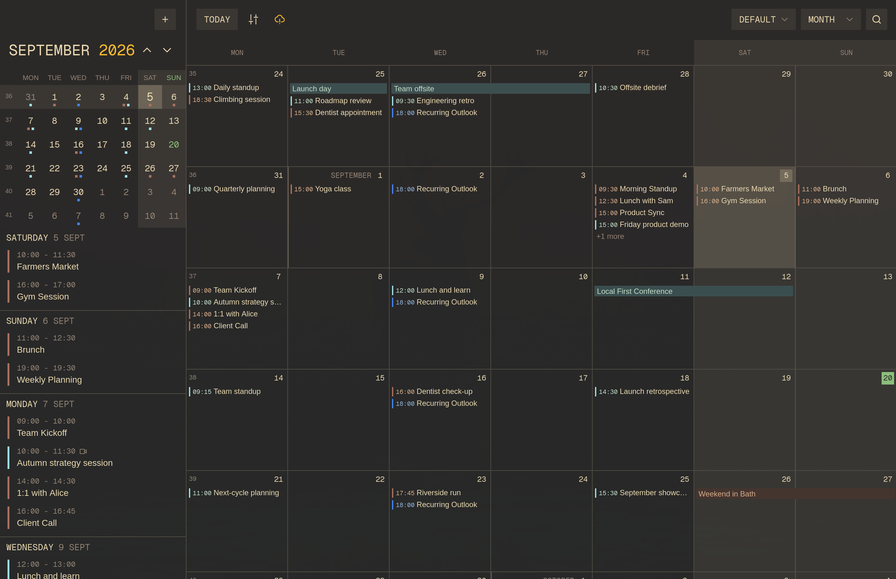
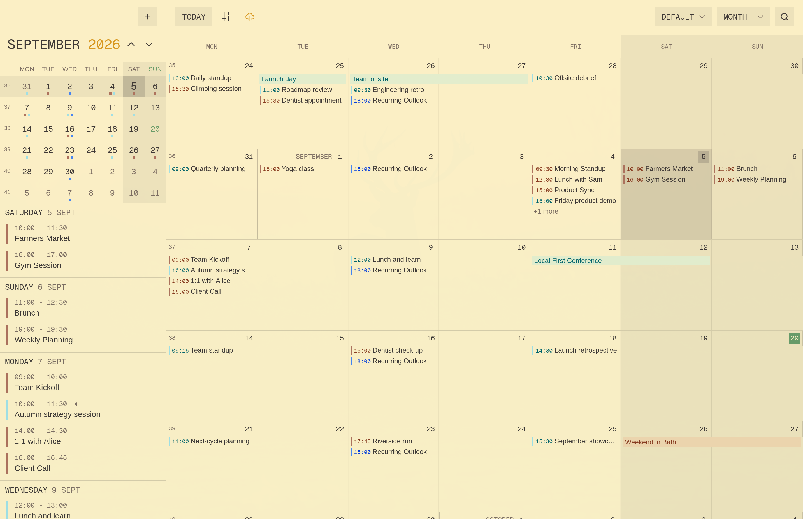

# Gruvbox theme for renCal

The [Gruvbox](https://github.com/morhetz/gruvbox) color scheme for
[renCal](https://rencal.org), with dark and light
variants.

| Gruvbox Dark | Gruvbox Light |
| :-----------: | :------------: |
|  |  |

## Installation

Install from a terminal on Linux:

```sh
rencal plugin install t4t5/rencal-theme-gruvbox
```

The themes appear under **Settings -> Themes** after installation.
